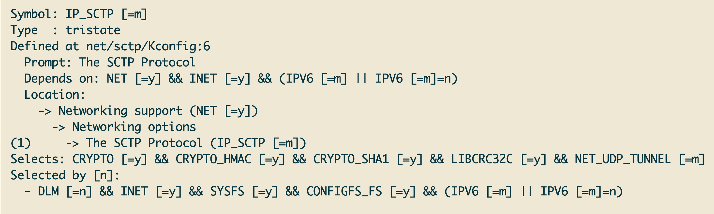

[](https://crates.io/crates/sctpx)
[](https://docs.rs/sctpx)
[](https://github.com/rust-util-collections/sctpx/actions/workflows/rust.yml)
[](https://github.com/rust-random/rand#rust-version-requirements)

# SCTPx

**A friendly rust-library for coding with `SCTP` protocol.**

**NOTE**

You should enable the system-level `sctp` supports first, a kernel config example on linux-6.6.30:


## Example

```rust
use sctpx::{client, server};
use ruc::{err::*, *};
use std::{sync::Arc, thread, time::Duration};

const ADDR: &str = "127.0.0.1:9999";

fn main() {
    thread::spawn(|| {
        let cb = |recvd: &[u8],
                  hdr: Arc<server::Hdr>,
                  peer: server::PeerAddr|
         -> Result<()> {
            assert_eq!(b"ABC", recvd);
            hdr
                .sendto(b"DEF", &peer)
                .map(|n| assert_eq!(n, 3)).c(d!())
        };
        pnk!(server::start_server(ADDR, None, cb, false));
    });

    // wait server to start
    thread::sleep(Duration::from_secs(1));

    let cli = pnk!(client::Hdr::new());
    assert_eq!(3, pnk!(cli.sendto_straddr(b"ABC", ADDR)));

    let buf = &mut [0; 8];
    let res = pnk!(cli.recvfrom(buf));
    assert_eq!(b"DEF", &buf[0..res.0]);
    assert_eq!(res.0, 3);
    assert_eq!(pnk!(res.1).to_string().as_str(), ADDR);
}
```
